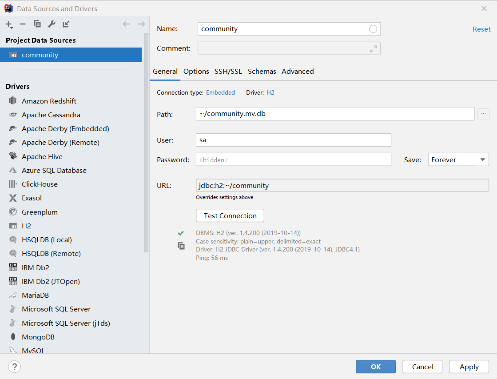

## 脚本

```shell script
mvn flyway::migrate
mvn -Dmybatis.generator.overwrite=true mybatis-generator:generate
```
## 输出GitHub姓名为null

1.检查github的setting-->profile-->name是否进行了设置

2.在GithubProvider的getUser中 request使用如下格式，注意"https"

```shell script
Request request = new Request.Builder()
        .url("https://api.github.com/user")
        .header("Authorization","token "+accessToken)
        .build();
```

## 连接H2一直提示输入账号密码

### 问题：

### 解决

1.删除数据库

2.删除.idea文件夹下datasource的xml文件

3.删除C盘administrator下的db文件

4.重新建立数据库，设置账号和密码



## SocketTimeoutException

### 问题：

在尝试使用GitHub登录网站的时候，出现此


### 解决：


## 带有驼峰命名不能正确赋值

问题：

数据库使用下划线，Java程序使用驼峰命名

解决：在application.properties中

```properties
mybatis.configuration.map-underscore-to-camel-case=true
```

## 当前页面分页跳转th:href

```html
th:href="@{/profile/{section}/(page=${paginationDTO.getTotalPage()},section=${section})}"
```

href中可以使用变量，只不过需要在最后的（）中，将其赋值即可

## 该网页无法正常运作localhost 将您重定向的次数过多。

页面循环跳转到同一页面，有死循环

## 无法正确生成mybatis generator的相关文件

看路径是否正确，以及码匠中使用的是life.majiang.xxx而我使用的是com.foling.xxx

## Mybatis无法生成Example类

Runtime注意是MyBatis3！

```
<context id="DB2Tables" targetRuntime="MyBatis3" defaultModelType="flat">
```

## \${session.githubUser}取值

前端需要在session中放值

```shell script
request.getSession().setAttribute("githubUser",githubUser);
```

## 前端获取后端的值，但是不显示在屏幕上

```html
<input type="hiddden",id="question_id" th:value="${question.id}"></input>
```

## 前端标签以逗号分割


## 关闭输入框提示

autocompleted:off

## 搜索问题

在搜索输入的input中使用name命名，在外面的form表单中使用action："/"，method：“get”。然后在对应的controller中便可以通过@PathVarible获取到

## 添加日志


配置一些项目

# IDEA
+ plugin加载不出来  
将Setting->Appearance&Behavior–>System Settings–>HTTP Proxy改为Auto-detect proxy settings

## 需要多个网站进行登录时

- 去对应的网站得到client-id放到项目中

## 回调url问题


注意允许哪里的使用，这里就需要配置哪里的网站